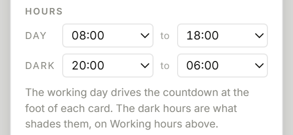
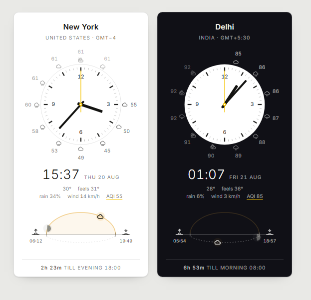

# Timezones

**[timezones.cc](https://timezones.cc/)**

A dashboard of minimal analog clocks for cities around the world: high-contrast
dials, fine minute ticks, flat hands and a yellow sweep second hand.

The board lives in `index.html`, with the city table, the time-zone helpers and the
astronomy split into three ES modules under `js/`: no build step, no dependencies,
no framework. Because they are modules, a browser will not load them over `file://`,
so this is served rather than opened from disk. Any static file server does, and
`python -m http.server` is enough to run it locally.

Two optional network requests: Inter from Google Fonts, and the forecast from
Open-Meteo if weather is on. Offline, the font falls back to the system UI sans and
the domes show no icons; clocks, sunrise and sunset are computed locally.


The board is the whole page. Controls are three floating buttons in the bottom-right:
add a city, copy-link, and settings.

Each card carries a dial, an eleven-hour forecast ring, the local time, the current
hour's readings, a sky dome showing where the sun is in that city's day, and a
countdown to the next end of the working day.

Under the time is everything known about the hour you are in:

```
        15°   feels 14°
  rain 5%   wind 9 km/h   AQI 18
```

The ring answers what is coming; this answers what it is like there now, which is
the question a board of clocks is usually being asked. Two lines rather than one:
all five on a single line ran the width of the card and read as a run-on, and the
temperature pair belongs together while the rest are separate answers. Separated by
space rather than by punctuation, since five readings and four middots is mostly
middots.

Whichever reading the ring is drawing is underlined in the accent, so the two are
visibly the same number. Anything the forecast did not carry is left out rather than
printed blank, air quality appears only when its setting is on, the whole block can
be switched off under **Readings**, and compact drops it, where there is no room.


The second hand is a continuous sweep at real speed, not a once-a-second tick. Measured
off the dial, it moves 1.5° every quarter second rather than jumping 6° and sitting
still.


London at night, Singapore mid-fade at 05:46, San Francisco in full daylight. The
card is the sky: it darkens with the city, through sunset and dusk to night, and the
dial stays pale on it like a moon. The page itself follows your own clock, not the
board's, so adding a city never flips the whole screen.


Click any digital time and type into it to convert that moment across the whole
board. Below, someone has proposed 14:30 their time in London: it is 06:30 in Santa
Cruz, an hour and a half before their morning, and 22:30 in Tokyo.


Clicking a city name opens a search over all 458 cities, each row showing its current
local time. Same-name cities are distinguished by region, which is why `Cambridge`
appears twice below.


The settings menu is one row per setting, in four groups: the label on the left, the
control on the right. Where both options are named modes the control shows every mode
at once, since a button you have to click repeatedly to discover what it cycles
through hides them. Where a setting is genuinely on or off, it is a switch.

Each row explains itself on hover rather than under itself. Fifteen sections with a
paragraph apiece stood 1341px tall, which is taller than the menu can show on a
1440x900 screen, so the last settings added to it were invisible without scrolling a
panel that gives no sign it scrolls. The same words are now on each row's title.


The forecast can ride the sky dome instead of the dial, covering the hours left in the
current span rather than a fixed twelve.


## Density

**Density** is `Auto`, `Full` or `Compact`. Auto goes compact below 560px, so a phone
gets four tiles across and eight cities fit on one screen instead of one and a half.

Compact drops what does not survive the size: the sky dome, the forecast ring, the
GMT line (the time already tells you which zone you are looking at), the dial numerals
and the minute ticks. What is left is a tile with the dial's hour bars, the time, the
next three hours of weather as icons, and a sunrise or sunset icon with the countdown
to whichever comes first. Tapping an hour mark still jumps there and the centre still
returns to now, but the preview tag is dropped, as is any wider label, and the winding
gestures go with them: at this size the dial is too small to drag against.


## Installing it

`manifest.webmanifest` makes it installable, so it can run in its own window with no
browser chrome, and get a home-screen or dock icon. Chrome and Edge offer Install;
iOS and Android use Add to Home Screen.

Without installing anything, `msedge --app=https://timezones.cc` (or `chrome`) also
opens a chromeless window, which is handy for a wall display.

`sw.js` caches the shell so the installed app works offline. It is network-first for
same-origin requests, falling back to the cache, so a deploy is picked up on the next
load rather than the installed copy going stale. Offline you keep the clocks, sunrise,
sunset and time conversion, since all of those are computed locally; only the forecast
is missing. The worker is only registered over http(s), which is now the only way the
page runs at all: the modules make `file://` a non-starter.

The tab title carries the first few clocks, so a pinned tab or a taskbar hover reads
as a status line. It always shows the real time, never a paused or wound one, since as
a readout it should not lie about what time it is.

## Choosing cities

**By URL**, comma-separated, in display order:

```
index.html?cities=san-francisco,new-york,london,tokyo
```

Each token is matched against city slugs (`new-york`), plain names (`New York`),
IANA zones (`Europe/London`), and aliases (`nyc`, `bombay`, `bangalore`, `hk`).
Unrecognised tokens are dropped.

**By clicking**: click any city name to replace that clock, or the plus in the dock to
append one. Search by city, region, country or time zone; arrow keys and Enter work.

There is a second way to append, in the gap after the last card where a new one would
appear, but it keeps out of the composition until you go looking for it: an `+ Add city`
tile that fades in when the pointer enters that empty cell, and stays hidden while the
window is unfocused, since a board being glanced at should not be offering anything to
click. It holds its grid cell either way, so nothing shifts when it appears. A permanent
dashed rectangle on every board was the loudest thing on an otherwise quiet page.

**Reordering**: drag a card and a caret appears in the gutter showing exactly where
it will land: the near half of a card means before it, the far half means after it.
No caret appears where the drop would put the card back where it started. The new
order is saved and written back to the URL. This uses HTML5 drag-and-drop, so it is
mouse and trackpad only; touch dragging is not supported.


Where a state or province is the more useful label the card shows that instead of the
country (`Santa Cruz / California`, `Cambridge / Massachusetts`). Same-name cities get
distinct slugs (`cambridge-ma` vs `cambridge`, `san-jose-ca` vs `san-jose`,
`portland-me` vs `portland`), and a guard at startup disambiguates any collision
rather than letting one city silently overwrite another.

Whatever is on screen is written back to the URL, so the address bar is always a
shareable link; the copy-link button puts it on the clipboard. The same list is saved
to `localStorage`, so a bare `index.html` reopens your last board. A `?cities=`
parameter always wins over the saved list.

## Converting a time

**Click a mark on any dial.** The dial is already a map of the day, so it is also the
control: click where you want the hour hand and the whole board goes to that time,
every card reading the same moment in its own zone. Click the centre and it comes
back to now. Nothing to hold down, and it works the same with a mouse or a thumb.

Hovering shows what a click will do: a ghost of the hour hand where it would land,
and a tag with the time it would set.

**Or drag round the ring of marks**, and the hour hand follows the pointer: a full turn
to twelve hours, accumulating rather than wrapping, so it carries straight past the end
of the dial's twelve and keeps going. Point at a time with a click, then drag from there
to run it forward or back. The gesture is confined to the ring on purpose. The centre
still means back to now, the space outside the rim is left to the card so a board can
still be reordered by dragging from a dial's outskirts, and touch is left alone
entirely, where a press is a tap and a drag is a scroll.

Clicks snap to the half hour. The hour marks are the obvious targets and each sits
dead centre of its own segment, while the midpoints between them cover the `:30` that
most meetings actually start on. A 12-hour dial names two times, and the nearer one is
the one meant, so clicking the mark behind the hour hand steps back an hour rather
than forward eleven and no click moves the board more than six hours.

**Or type it.** Click any card's digital time and type into it, which is what you want
when someone quotes a time in their own zone. The field is forgiving about format:
`14:30`, `1430`, `930`, `2.30`, `2h30`, `2:30pm`, `9a` and a bare `14` all work. While
what you have typed is not yet a valid time the underline turns red and the board holds
the last good instant, so it does not lurch around mid-keystroke.

`Enter` commits and closes the field, rewriting what you typed in the format you have
chosen: `6pm` settles as `18:00`, or as `6 pm` on 12-hour. Switching that setting
reformats a field left open, too. The value is read back from the instant the board is
holding rather than from your keystrokes, so it is the committed time being shown, not a
tidied version of the text.

Clicking away commits it too. Losing focus used to throw the time away and snap the
board back to now, which made the field feel like a trap: the first click elsewhere puts
the typed time down, and only a second one returns to now.

**Or step by the hour.** `←` and `→` move the board back and forward an hour at a
time. They stay out of the way where they already mean something: inside the time
field they move the caret, inside the settings menu they change the setting.

Any of these can be mixed. `Esc`, a click on a dial's centre, or a click away from an
already-committed board returns to now and the second hand starts sweeping again.

Two older gestures stay behind modifiers. Hold **Shift** and drag a dial like a sprung
joystick: pull left or right of where you started and time runs that way for as long as
you hold, faster the further you pull, squared, so it is a few minutes a second near the
dead zone and two hours a second at full stretch. The pill at the foot of the screen
reports the direction and speed while it runs. Hold **Alt** instead and the drag winds
by the minute hand rather than the hour hand: six degrees is one minute, and a full turn
is an hour. Fine, but tedious over any real distance.

Because everything on a card is derived from a single instant, pausing on one makes
the *whole* card describe that moment, not just the digits: the sky domes move the sun
and moon to where they will be, the cards take on the darkness they will have, and the
footer counts down from then. That is how the screenshot above shows at a glance that
the proposed time lands before Santa Cruz's working day.

Two details worth knowing:

- The date is anchored to the edited city's local date when you start typing, so
  entering `00:30` after `23:30` stays on the same day instead of drifting.
- Converting a wall-clock time to an instant cannot assume an offset, because the
  offset in force depends on the answer. `zonedTimeToEpoch` solves it by correction
  instead, which handles half-hour zones (Kolkata, Kathmandu, St. John's) and
  daylight-saving changes. A local time that does not exist, 02:30 on a
  spring-forward morning, resolves to a real adjacent instant rather than `NaN`.

## Reaching a setting from the card

The read-outs that are governed by a setting open the menu at that setting: the date
opens `Date`, the countdown opens `Hours`, the sky band opens `Weather forecast`. The
section flashes once so it is obvious where you landed. With thirteen sections in the
menu, the shortest path to the switch behind a thing is the thing itself. They are quiet
until hovered, since a card full of underlined links would undo the point of the layout,
and they do not count as clicking away, so a paused board stays paused.

## Reading a clock

- **The sky dome** at the foot of each card is a whole circle seen edge on: a horizon
  line, the day arc above it, and a dashed trough below for the half of the sky you
  cannot see. Sun and moon are both on it at all times, so one of the two is always in
  the trough, dimmed. A body rises at the left end, arcs over the top, sets at the
  right end and carries on leftwards through the trough to rise again where it
  started. They circle, rather than each crossing left to right in turn, which is what
  makes it read as one movement instead of two.
- **The moon shows its real phase**, as it is seen from that city: only the lit part,
  since the dark limb is not visible in the sky either, with the terminator swept
  across it so it thins to a crescent and fills to a plain disc when full. South of
  the equator the lit limb swaps sides, because the whole thing is seen upside down
  from there. Hovering names it, `Waxing gibbous, 63% lit`.

  The disc is about 13px across, which sets a floor on what the shape can say: drawn
  honestly, a 7% crescent is a sliver 0.8px wide, which is invisible beside anything
  else on the card. An earlier version also outlined the whole disc faintly so that a
  new moon still had a shape, and the result was the worst of both: the outline was
  legible, the crescent inside it was not, and every phase read as full. So the
  outline is gone, a glow marks the position instead, and the terminator is capped so
  a thin crescent is drawn at about a tenth of the disc. Only the last 2% at either
  end is exact: new moon draws nothing, which is what you can see of it, and full
  draws a plain disc. The tooltip always has the true figure.
- **Phase and position come from the same geometry**, so they agree: at full moon the
  moon rises as the sun sets and the two sit opposite each other on the dome, and at
  new moon they cross the sky together.
- **The horizontal axis is progress, not clock angle.** The left end is always the
  rising horizon and the right end the setting one, however long the day happens to
  be, so the sun at the apex means solar noon and halfway up the left slope means the
  morning is half gone. This is deliberately *not* a clock scale: an earlier version
  wrapped a 24-hour ring around the 12-hour dial, and the two never lining up was
  confusing.
- **Sunrise and sunset sit at the ends of the arc they belong to**, on the horizon
  line, rather than in a row of their own underneath. Each glyph contains a horizon
  of its own, a third of the way up its box, and it is placed so that line falls
  exactly on the dome's: the dome's horizon runs straight through the icon and out
  the other side, which is what ties the time to its end of the arc. The time goes
  below in a smaller face. The arc gives up 16 units at each end to make room, and
  the horizon line still runs the full width, so the labels sit on the part of it
  that was already extending past the arc.
- **The sun's glyph is the current conditions**, and nothing but the glyph. The number
  that used to sit beside it is on the line under the time, where it is one of five
  rather than a lone value crowding the sunrise and sunset labels. This costs nothing
  when the sky is clear,
  since a clear sky's icon is a rayed sun already, and when it is not clear the sun
  becomes the cloud or the rain that is actually there, keeping its warm halo so its
  position still reads. The day form of the icon is used at every hour on purpose:
  the night form of "clear" is a moon, which would put a second moon on the dome a
  few units from the real one. A rayed sun in the trough is not wrong, it says the
  sun is down there and the sky is clear. The temperature stays on the inward side
  of the body so it never reaches the sunrise and sunset labels, and it does not dim
  with the glyph when the sun is under the horizon, since it describes now rather
  than what is visible.
- **Both bodies move in real time**, repositioned every frame.
- **The second hand floats**, a true continuous sweep driven off the epoch so every
  card is in lockstep. The minute and hour hands drift continuously too.
- **Beside the time is that city's date**, `Tue 18 Aug`, rather than today or tomorrow.
  A date is absolute and needs no reference point, which is what you want on a board
  where the cards differ from each other and not only from you. **Date** offers three
  forms: `Mon` alone, `Mon 7 Jul`, or ISO `2026-07-07` for when it has to be
  unambiguous. Compact tiles ignore the setting and keep their own rule of saying only
  what is surprising, since nothing longer fits beside a 15px time in 78px: your own
  date is left blank, another one gets three letters.
- **Nightfall fades a surface between light and dark** rather than flipping it, from a
  single 0-1 darkness value recomputed every second. **Night darkens** chooses which
  surface. *The card* (the default) treats the card as the sky, running white to
  sunset to dusk blue to near black while the dial holds still as a pale disc on it:
  the thing that changes is the thing that actually changes outdoors, and the dial
  ends up reading as the moon. *The dial* is the older arrangement, where only the
  watch face fades and every card keeps the page theme, which is steadier on a wall
  of cards.

  Either way the fading surface's own text does not interpolate with it. At the
  midpoint it would land on the same grey as its background and vanish, which is the
  exact problem the fade was meant to avoid, so it steps at the halfway point instead.
  On that crossover colour, black reads at about 4.6:1 and white at about 4.5:1, so
  both halves stay legible. The surface cross-fades over a third of a second and the
  ink does not, for the same reason.
- **Night follows** decides what darkness means. *Working hours* (the default) uses
  the fixed evening window in `CONFIG`, fading over 45 minutes either side, so every
  city behaves the same and the board is easy to scan. *Real sun* uses the sun's true
  altitude, fading across civil twilight, so high latitudes look right:

  ```
  Stockholm, one character per hour, '.' = light, '#' = dark
  jun21/working hours:  ######+.............+###
  jun21/real sun:       ###*..................:*     sunrise 03:32, sunset 22:09
  dec21/working hours:  ######+.............+###
  dec21/real sun:       #########:.....+########     sunrise 08:44, sunset 14:49
  ```

  The page itself, on *Auto*, follows the same fixed evening where *you* are. It used
  to be a majority vote of the cards on screen, which drifted with no visible cause:
  adding a city or one card crossing dusk could flip the entire page.
- **One quiet line at the foot** counts down to whichever end of the working day
  comes round next: `11h 57m till morning 08:00`, or `57m till evening 18:00` if
  that is sooner.

## Configuration

**Hours** in the settings menu sets the shape of the day: the working day, which drives
the countdown at the foot of each card, and the dark hours, which are what shades them
on *Working hours*. Four hour pickers, labelled in whichever format you have chosen, and
persisted like every other setting.



The window that counts as night is read as a window on the 24-hour circle rather than
as an overnight span, so either order of its two ends means something: `20:00` to `06:00`
is a night, and `06:00` to `20:00` would be a day. Setting both ends the same means no
dark window at all, where the old form silently returned the whole circle and left every
card dark forever.

`CONFIG` at the top of the script holds the defaults for those four, plus the constants
that stay constants:

```js
const CONFIG = {
  morning:   8 * 60,   // 08:00, start of the working day     ) defaults for
  evening:  18 * 60,   // 18:00, end of the working day       ) the four
  nightFrom: 20 * 60,  // 20:00, the shading goes fully dark  ) pickers in
  nightTo:    6 * 60,  // 06:00, and fully light again        ) the menu
  fade:          45,   // minutes either side of those, spent fading
  dayAbove:       2,   // sun this high  = full daylight        ("solar" mode)
  nightBelow:    -6    // sun this low   = full dark (civil twilight)
};
```

A short fade window with a long dark one is fine; the reverse degrades gracefully rather
than breaking, since `darkness` measures the distance to the nearer end of the window and
simply never reaches full dark if the window is shorter than twice the fade.

On *Working hours* the shading is on fixed hours while the sun and moon follow real
astronomy, so the two can legitimately disagree: Tokyo at 05:21 shows a dark card with
the sun already up on the dome, which is exactly the situation you want to see before
scheduling a call there. *Real sun* removes that disagreement at the cost of every city
behaving differently.

## The face

**Numerals** is `None`, `12 3 6 9`, or `All 12`. **Dial marks** turns the hour and minute
marks on or off, and with them gone the numerals move out to the band the marks occupied,
because that is where the eye reads a dial and leaving it empty makes the face look
unfinished rather than clean. All twelve numerals are set a size smaller, since twelve of
them at full size crowd the ring.

**Preset** is a shortcut across those and the forecast, named after what the face
carries rather than after a style:

| | Numerals | Marks | Forecast |
|---|---|---|---|
| **Classic** | `12 3 6 9` | on | none |
| **Minimal** | none | off | none |
| **Weather** | `12 3 6 9` | on | dial ring, temperatures and conditions |

A preset is a shortcut, not a mode: it sets those switches and is then forgotten. The row
shows one as chosen only while every value it names still matches, so it stops claiming
credit the moment anything is changed by hand.

## Weather

Three placements for the forecast. Current conditions are not one of them: they are
always the sun's own glyph on the dome, as above.

**Dial (default)**: a ring outside the dial, one entry per coming hour. The analog
face already maps hours to angles, so each forecast hour sits at its own hour
position and the ring reads clockwise from the hour hand. The angle comes from that
hour's local wall-clock time rather than a slot index, so half-hour zones like
Kolkata and Kathmandu land correctly between marks. Opacity falls off with distance
in time, giving the reading direction.

The ring shows **eleven** hours, not twelve, and that is deliberate. Twelve hours is
a full turn of this dial, so the twelfth entry lands on exactly the same angle as the
current hour. That closed the ring into a seamless circle, with the faintest entry
sitting under the hour hand right beside the strongest, with nothing to read it from, and
the whole ring appeared to shuffle arbitrarily whenever the time changed. Stopping one
short leaves a gap, and the gap falls on the hour just gone.

The ring starts at the hour you are in, not the next one. Starting at the next hour
put the gap under the hour hand, so the hand pointed at nothing and the hour the rest
of the card was describing was the one hour the ring left out.

**Dial ring** chooses what the ring carries: `Icons`, `Numbers`, or `Both`, which is
the default: numbers on an outer ring with conditions on an inner one. Which number is
a separate choice, made under Ring metric below, which is why this one is not called
Temps: it was, back when temperature was the only reading it could carry.

The viewBox opens up to fit whichever is shown, allowing for the width of the labels
as well as the radius of the ring, since a reading like `-10°` at the three o'clock
position otherwise overhangs the box and gets clipped. Two rings is also why the
default costs the dial some size, and why the ring is drawn lighter than the dial's
own marks: it is context around the clock, not part of it.


**Ring metric** chooses which number the ring and the dome readout print: `Temp`,
`Feels` (apparent temperature, what it feels like with wind and humidity), `Rain`
(chance of precipitation), `Wind`, or `Air` when air quality is on. One request per
city already carried three days of hours, so those four are close to free: the same
call, a couple of kilobytes more, and no second endpoint. What is not on the ring is
in the tooltips, which cost nothing at all:

```
22:00 · Overcast · 22° (feels 21°) · 0% rain · wind 13km/h · 57% humidity
```

Wind is the one reading whose unit is dropped from the ring. `22km/h` at the three
o'clock position is wide enough to overhang the dial's box and get clipped, and eleven
copies of a unit is noise anyway; the dome readout has room and keeps it.

**Air quality** is off by default, and is the one reading that costs a request of its
own. Open-Meteo serves it free and keyless like the forecast, but from a different
host, so it cannot ride along on the call already being made. A board that never asks
the question should not pay a second round trip per city for it, which is why this is
a switch rather than simply another metric.

Turned on, it adds `Air` to the ring metric and puts the index and pm2.5 into every
forecast tooltip. The number is the European AQI, where lower is cleaner. It is left
uncoloured on purpose: the board has one accent, and spending it on six air-quality
bands would shout over the clocks, so the band is named in the tooltip instead.



```
01:00 · Partly cloudy · 18° (feels 17°) · 0% rain · wind 11km/h · 63% humidity ·
air 19 (Good) · pm2.5 5
```

It keeps its own cache, separate from the forecast's, so turning it on does not
invalidate every stored forecast for a field most boards never show.

**Readings** switches off the two lines under the time, for a board that wants the
clocks and nothing else. The tooltips still carry everything, so nothing is lost,
only unasked for.

**City caps** writes the names as `SAN FRANCISCO` rather than `San Francisco`. Off by
default. The name is written once, when a card is built, so this rebuilds the board
rather than repainting it.

**Temperature** switches between `°C` and `°F`. Open-Meteo is asked for Celsius and
the conversion happens locally, so switching units costs no request and never
invalidates the cache.

**Dome**: icons along the sky dome for the hours remaining in the current span, now
until sunset by day, now until sunrise by night. Spaced by distance along the arc
rather than by clock hour, because `skyX` is a cosine that barely moves near sunrise
and sunset while the hours keep passing, so every-Nth-hour piles them into a heap at
the ends. The trade-off is that a span with little arc left shows fewer icons; late
afternoon might only fit two before sunset. They follow the sun's own direction of
travel, so at night, in the trough, they read right to left.

**Off**: no forecast, no requests, and the dial gets a slightly roomier viewBox.

Data comes from [Open-Meteo](https://open-meteo.com), which needs no API key and
allows browser requests. One call per city covers 72 hours; responses are cached in
`localStorage` for 30 minutes. If the request fails, the icons simply don't appear.

Every setting in the menu persists to `localStorage`.

## Deploying

The site is static files at the repository root, so there is nothing to build.
`wrangler.jsonc` declares an assets-only Cloudflare Worker with no script and no `main`
entry, and `.assetsignore` keeps the repo's own files (this README, `docs/`) out of
the deployed bundle. Keeping the config in the repo rather than only in the dashboard
means the deploy is reviewable and reproducible.

Nothing here needs server-side code today. If it ever does, an assets-only Worker
becomes a Worker with a handler by adding one file and a `main` entry, so there is no
migration to plan for. The candidates, in the order I would actually bother:

1. **Caching the forecast at the edge.** Each visitor's browser currently fetches
   about 1.6 KB per city straight from Open-Meteo, taking roughly 0.8 s. Caching per
   city for 30 minutes would let all visitors share one upstream fetch, which protects
   the free quota, speeds up first paint, and stops visitors' addresses reaching a
   third party.
2. **Dynamic social preview images**, rendering the actual dials for the cities in a
   shared link. The one item here that genuinely cannot be done in the browser.
3. **A plain-text endpoint**, so `curl timezones.cc/tokyo` answers from a terminal.

Worth noting what does *not* need code: defaulting the board to the visitor's own zone
(`Intl.DateTimeFormat().resolvedOptions().timeZone` gives it client-side), self-hosting
Inter (commit the woff2), and analytics.

## Sun and moon calculations

Sunrise and sunset are computed in-page from each city's latitude and longitude
using the standard NOAA sunrise equation, with the −0.833° altitude used for the
apparent solar disc. Spot-checked against published almanac times for London,
New York, Singapore and Sydney at both solstices, agreement within ~2 minutes.

Placing the two bodies on the dome takes more than a pair of times, since each has to
be somewhere at every moment, including under the horizon. So each gets a right
ascension, a declination and an hour angle, and `domeSpot` turns those into a position:
`|H| < W` is above the horizon and on the arc, the rest is the trough, where `W` is the
same half-day-length term the sunrise equation uses, which is why the arc's ends agree
with the printed sunrise and sunset. No scanning for moonrise, and nothing to special
case between day and night.

The series are the usual low-precision ones, good to about a minute of arc for the sun
and 0.3° for the moon, which at this size is a fraction of a pixel. Both depend only on
the instant, so they are evaluated once per frame and shared by every card; only the
hour angle is per city. The phase comes from the elongation between the two, so it is
consistent with where they are drawn: the new moon of 12 August 2026, the day of that
solar eclipse, computes as 0.0% lit at 17:46 UTC.

Polar day and polar night are handled: the labels become `midnight sun` / `polar night`
and a circumpolar body runs once round its half of the dome per day. Tromsø and
Longyearbyen are in the list, so that branch is reachable; try Longyearbyen in June or
December.

Adding a city means one row in the `CITY_DATA` table near the top of the script.
The last three fields are optional:

```js
["Name", "Country", "IANA/Zone", lat, lon, "extra search terms", "Region", "id-override"]
```

To check a batch of additions, loop `CITIES` in the console, calling
`Intl.DateTimeFormat` with each `tz` to confirm the runtime knows the zone, and
`sunFor` to confirm sunrise precedes sunset.
