# Timezones

**[timezones.cc](https://timezones.cc/)**

A dashboard of minimal analog clocks for cities around the world: high-contrast
dials, fine minute ticks, flat hands and a yellow sweep second hand.

Everything lives in one `index.html`: no build step, no dependencies, no framework.
Open it from disk or host it as a static file.

Two optional network requests: Inter from Google Fonts, and the forecast from
Open-Meteo if weather is on. Offline, the font falls back to the system UI sans and
the domes show no icons; clocks, sunrise and sunset are computed locally.

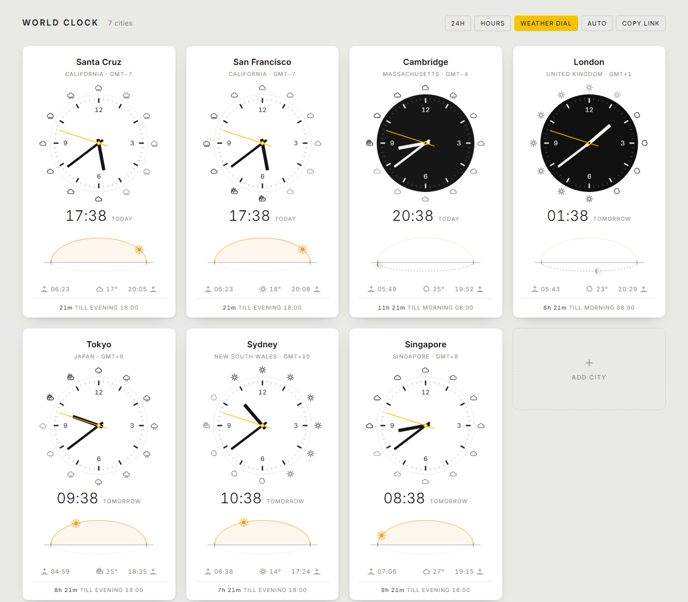

The board is the whole page. Controls are two floating buttons in the bottom-right:
copy-link and settings.

Each card carries a dial, a twelve-hour forecast ring, the local time, a sky dome
showing where the sun is in that city's day, and a countdown to the next end of the
working day.

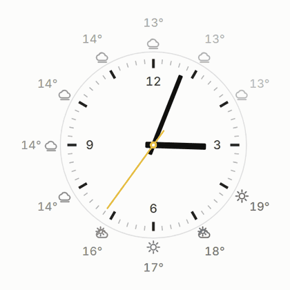

The second hand is a continuous sweep at real speed, not a once-a-second tick. Measured
off the dial, it moves 1.5° every quarter second rather than jumping 6° and sitting
still.

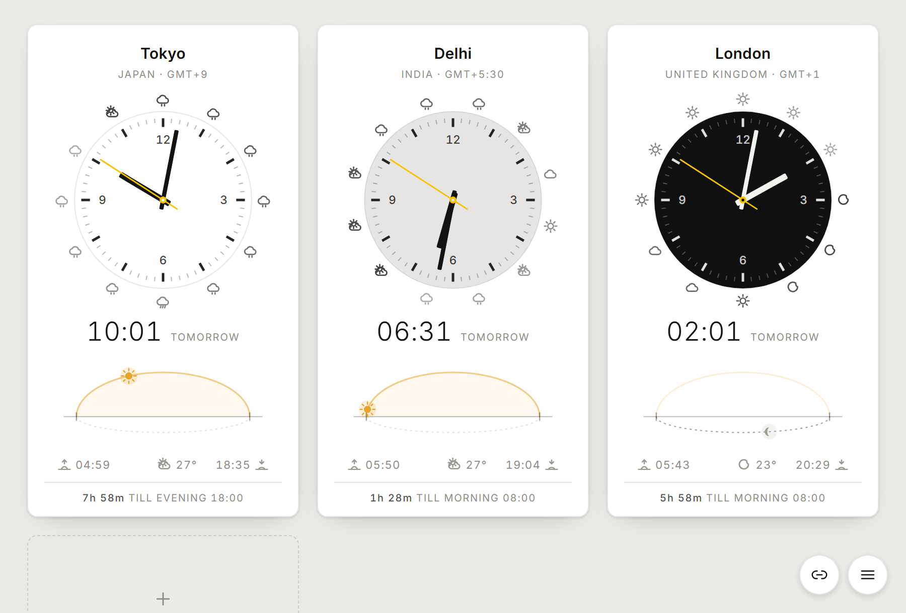

Tokyo in full daylight, Delhi mid-fade at 06:10, London at night. The card is the
sky: it darkens with the city, through sunset and dusk to night, and the dial stays
pale on it like a moon. The page itself follows your own clock, not the board's, so
adding a city never flips the whole screen.

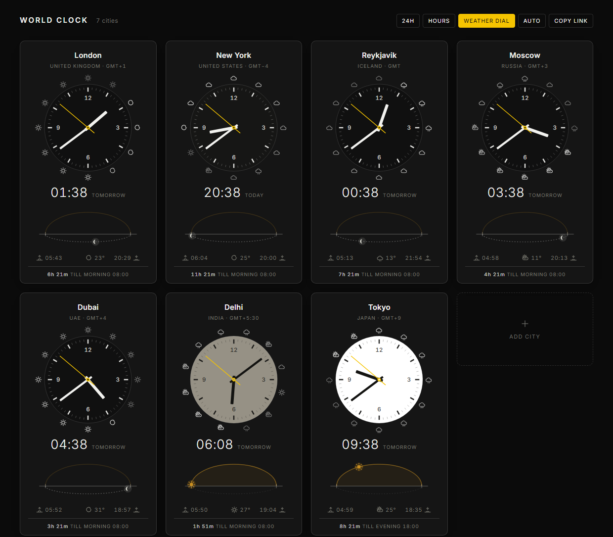

Click any digital time and type into it to convert that moment across the whole
board. Below, someone has proposed 14:30 their time in London: it is 06:30 in Santa
Cruz, an hour and a half before their morning, and 22:30 in Tokyo.

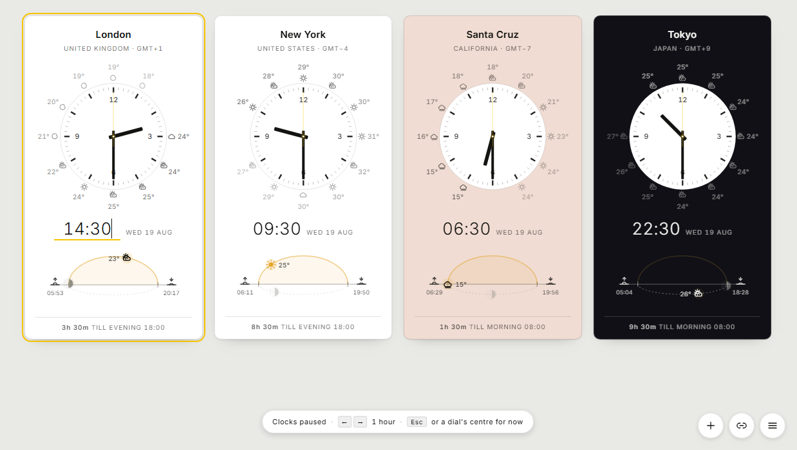

Clicking a city name opens a search over all 458 cities, each row showing its current
local time. Same-name cities are distinguished by region, which is why `Cambridge`
appears twice below.

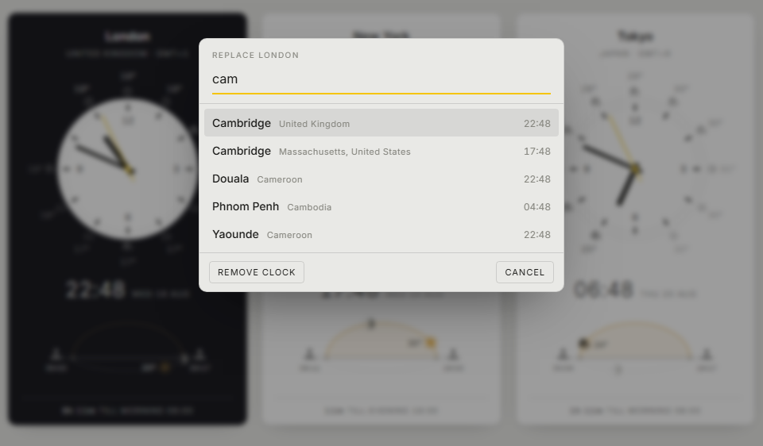

The settings menu shows every mode at once and explains whichever one is selected.
Two of the settings are modes rather than on/off switches, which a cycling button
made impossible to discover.

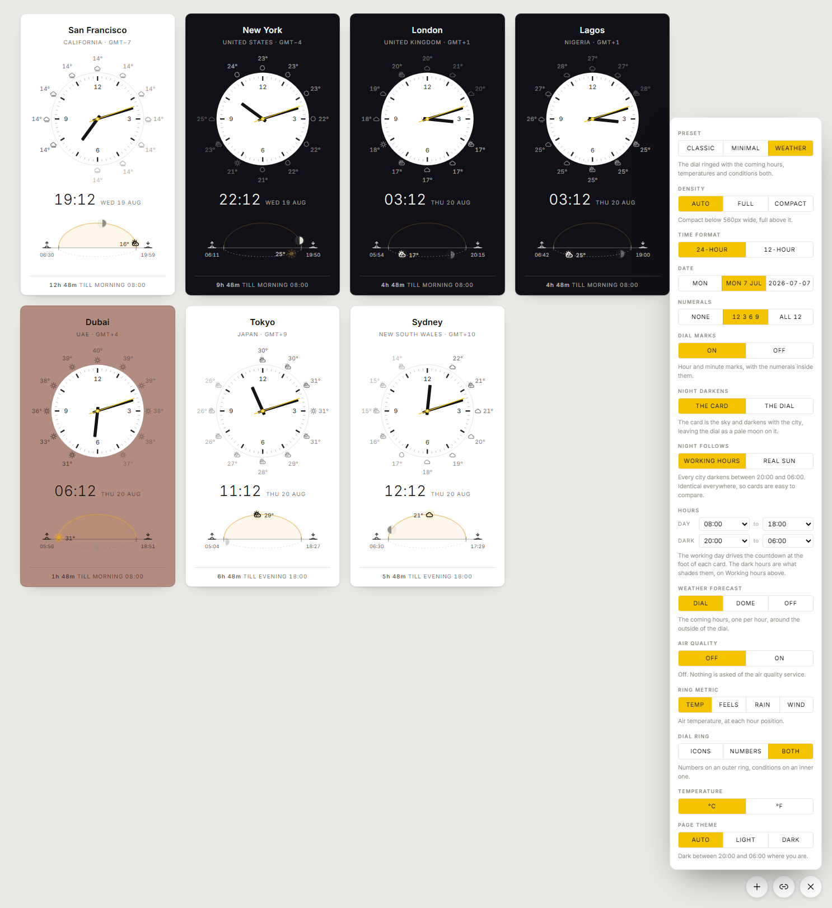

The forecast can ride the sky dome instead of the dial, covering the hours left in the
current span rather than a fixed twelve.

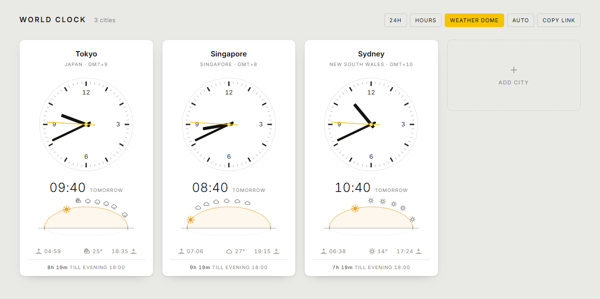

## Density

**Density** is `Auto`, `Full` or `Compact`. Auto goes compact below 560px, so a phone
gets four tiles across and eight cities fit on one screen instead of one and a half.

Compact drops what does not survive the size: the sky dome, the forecast ring, the
GMT line (the time already tells you which zone you are looking at), the dial numerals
and the minute ticks. What is left is a tile with the dial's hour bars, the time, the
next three hours of weather as icons, and a sunrise or sunset icon with the countdown
to whichever comes first. Tapping an hour mark still jumps there and the centre still
returns to now, but the preview tag is dropped, as is any wider label, and the winding
gestures go with them: at this size the dial is too small to drag against.

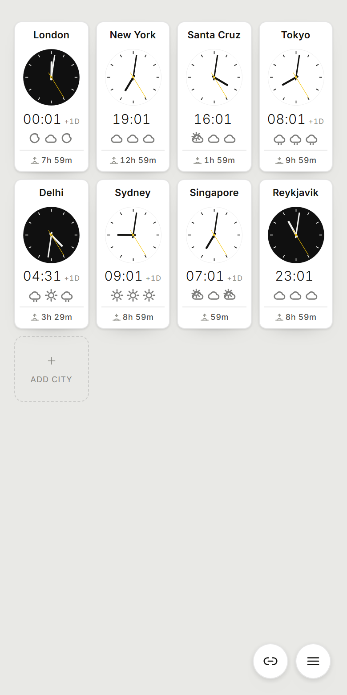

## Installing it

`manifest.webmanifest` makes it installable, so it can run in its own window with no
browser chrome, and get a home-screen or dock icon. Chrome and Edge offer Install;
iOS and Android use Add to Home Screen.

Without installing anything, `msedge --app=https://timezones.cc` (or `chrome`) also
opens a chromeless window, which is handy for a wall display.

`sw.js` caches the shell so the installed app works offline. It is network-first for
same-origin requests, falling back to the cache, so a deploy is picked up on the next
load rather than the installed copy going stale. Offline you keep the clocks, sunrise,
sunset and time conversion, since all of those are computed locally; only the forecast
is missing. The worker is only registered over http(s), and opening `index.html` from disk
stays a supported way to use this.

The tab title carries the first few clocks, so a pinned tab or a taskbar hover reads
as a status line. It always shows the real time, never a paused or wound one, since as
a readout it should not lie about what time it is.

## Choosing cities

**By URL**, comma-separated, in display order:

```
index.html?cities=san-francisco,new-york,london,tokyo
```

Each token is matched against city slugs (`new-york`), plain names (`New York`),
IANA zones (`Europe/London`), and aliases (`nyc`, `bombay`, `bangalore`, `hk`).
Unrecognised tokens are dropped.

**By clicking**: click any city name to replace that clock, or the `+ Add city`
tile to append one. Search by city, region, country or time zone; arrow keys and
Enter work.

**Reordering**: drag a card and a caret appears in the gutter showing exactly where
it will land: the near half of a card means before it, the far half means after it.
No caret appears where the drop would put the card back where it started. The new
order is saved and written back to the URL. This uses HTML5 drag-and-drop, so it is
mouse and trackpad only; touch dragging is not supported.

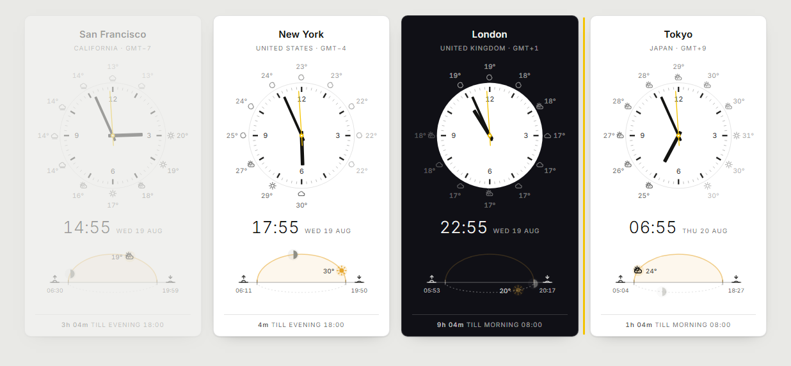

Where a state or province is the more useful label the card shows that instead of the
country (`Santa Cruz / California`, `Cambridge / Massachusetts`). Same-name cities get
distinct slugs (`cambridge-ma` vs `cambridge`, `san-jose-ca` vs `san-jose`,
`portland-me` vs `portland`), and a guard at startup disambiguates any collision
rather than letting one city silently overwrite another.

Whatever is on screen is written back to the URL, so the address bar is always a
shareable link; the copy-link button puts it on the clipboard. The same list is saved
to `localStorage`, so a bare `index.html` reopens your last board. A `?cities=`
parameter always wins over the saved list.

## Converting a time

**Click a mark on any dial.** The dial is already a map of the day, so it is also the
control: click where you want the hour hand and the whole board goes to that time,
every card reading the same moment in its own zone. Click the centre and it comes
back to now. Nothing to hold down, and it works the same with a mouse or a thumb.

Hovering shows what a click will do: a ghost of the hour hand where it would land,
and a tag with the time it would set.

Clicks snap to the half hour. The hour marks are the obvious targets and each sits
dead centre of its own segment, while the midpoints between them cover the `:30` that
most meetings actually start on. A 12-hour dial names two times, and the nearer one is
the one meant, so clicking the mark behind the hour hand steps back an hour rather
than forward eleven and no click moves the board more than six hours.

**Or type it.** Click any card's digital time and type into it, which is what you want
when someone quotes a time in their own zone. The field is forgiving about format:
`14:30`, `1430`, `930`, `2.30`, `2h30`, `2:30pm`, `9a` and a bare `14` all work. While
what you have typed is not yet a valid time the underline turns red and the board holds
the last good instant, so it does not lurch around mid-keystroke.

**Or step by the hour.** `←` and `→` move the board back and forward an hour at a
time. They stay out of the way where they already mean something: inside the time
field they move the caret, inside the settings menu they change the setting.

Any of these can be mixed. `Esc`, a click away, or a click on a dial's centre returns
to now and the second hand starts sweeping again.

Two hidden gestures remain for winding time continuously, both behind a modifier since
a plain press on a dial now means jump. Hold **Shift** and drag a dial like a sprung
joystick: pull left or right of where you started and time runs that way for as long as
you hold, faster the further you pull, squared, so it is a few minutes a second near the
dead zone and two hours a second at full stretch. The pill at the foot of the screen
reports the direction and speed while it runs. Hold **Alt** instead and the drag winds
time literally: six degrees is one minute, so the minute hand tracks the pointer and a
full turn is an hour. Precise, but tedious over any real distance.

Because everything on a card is derived from a single instant, pausing on one makes
the *whole* card describe that moment, not just the digits: the sky domes move the sun
and moon to where they will be, the cards take on the darkness they will have, and the
footer counts down from then. That is how the screenshot above shows at a glance that
the proposed time lands before Santa Cruz's working day.

Two details worth knowing:

- The date is anchored to the edited city's local date when you start typing, so
  entering `00:30` after `23:30` stays on the same day instead of drifting.
- Converting a wall-clock time to an instant cannot assume an offset, because the
  offset in force depends on the answer. `zonedTimeToEpoch` solves it by correction
  instead, which handles half-hour zones (Kolkata, Kathmandu, St. John's) and
  daylight-saving changes. A local time that does not exist, 02:30 on a
  spring-forward morning, resolves to a real adjacent instant rather than `NaN`.

## Reading a clock

- **The sky dome** at the foot of each card is a whole circle seen edge on: a horizon
  line, the day arc above it, and a dashed trough below for the half of the sky you
  cannot see. Sun and moon are both on it at all times, so one of the two is always in
  the trough, dimmed. A body rises at the left end, arcs over the top, sets at the
  right end and carries on leftwards through the trough to rise again where it
  started. They circle, rather than each crossing left to right in turn, which is what
  makes it read as one movement instead of two.
- **The moon shows its real phase**, as it is seen from that city: a disc with the
  terminator swept across it, so it thins to nothing at new moon and fills to a plain
  white disc when full. South of the equator the lit limb swaps sides, because the
  whole thing is seen upside down from there. Hovering names it, `Waxing gibbous,
  63% lit`. This falls out of the same geometry as the positions, so at full moon the
  moon rises as the sun sets and the two sit opposite each other on the dome, and at
  new moon they cross the sky together.
- **The horizontal axis is progress, not clock angle.** The left end is always the
  rising horizon and the right end the setting one, however long the day happens to
  be, so the sun at the apex means solar noon and halfway up the left slope means the
  morning is half gone. Sunrise and sunset times are printed at the two ends.
  This is deliberately *not* a clock scale: an earlier version wrapped a 24-hour
  ring around the 12-hour dial, and the two never lining up was confusing.
- **Both bodies move in real time**, repositioned every frame.
- **The second hand floats**, a true continuous sweep driven off the epoch so every
  card is in lockstep. The minute and hour hands drift continuously too.
- **Nightfall fades a surface between light and dark** rather than flipping it, from a
  single 0-1 darkness value recomputed every second. **Night darkens** chooses which
  surface. *The card* (the default) treats the card as the sky, running white to
  sunset to dusk blue to near black while the dial holds still as a pale disc on it:
  the thing that changes is the thing that actually changes outdoors, and the dial
  ends up reading as the moon. *The dial* is the older arrangement, where only the
  watch face fades and every card keeps the page theme, which is steadier on a wall
  of cards.

  Either way the fading surface's own text does not interpolate with it. At the
  midpoint it would land on the same grey as its background and vanish, which is the
  exact problem the fade was meant to avoid, so it steps at the halfway point instead.
  On that crossover colour, black reads at about 4.6:1 and white at about 4.5:1, so
  both halves stay legible. The surface cross-fades over a third of a second and the
  ink does not, for the same reason.
- **Night follows** decides what darkness means. *Working hours* (the default) uses
  the fixed evening window in `CONFIG`, fading over 45 minutes either side, so every
  city behaves the same and the board is easy to scan. *Real sun* uses the sun's true
  altitude, fading across civil twilight, so high latitudes look right:

  ```
  Stockholm, one character per hour, '.' = light, '#' = dark
  jun21/working hours:  ######+.............+###
  jun21/real sun:       ###*..................:*     sunrise 03:32, sunset 22:09
  dec21/working hours:  ######+.............+###
  dec21/real sun:       #########:.....+########     sunrise 08:44, sunset 14:49
  ```

  The page itself, on *Auto*, follows the same fixed evening where *you* are. It used
  to be a majority vote of the cards on screen, which drifted with no visible cause:
  adding a city or one card crossing dusk could flip the entire page.
- **One quiet line at the foot** counts down to whichever end of the working day
  comes round next: `11h 57m till morning 08:00`, or `57m till evening 18:00` if
  that is sooner.

## Configuration

Four constants at the top of the script define the shape of the day:

```js
const CONFIG = {
  morning:   8 * 60,   // 08:00, start of the working day
  evening:  18 * 60,   // 18:00, end of the working day
  nightFrom: 20 * 60,  // 20:00, the shading goes fully dark  ("hours" mode)
  nightTo:    6 * 60,  // 06:00, and fully light again
  fade:          45,   // minutes either side of those, spent fading
  dayAbove:       2,   // sun this high  = full daylight        ("solar" mode)
  nightBelow:    -6    // sun this low   = full dark (civil twilight)
};
```

On *Working hours* the shading is on fixed hours while the sun and moon follow real
astronomy, so the two can legitimately disagree: Tokyo at 05:21 shows a dark card with
the sun already up on the dome, which is exactly the situation you want to see before
scheduling a call there. *Real sun* removes that disagreement at the cost of every city
behaving differently.

## Weather

Three placements, all of which draw current conditions and temperature in the middle
of the label row.

**Dial (default)**: a ring outside the dial, one entry per coming hour. The analog
face already maps hours to angles, so each forecast hour sits at its own hour
position and the ring reads clockwise from the hour hand. The angle comes from that
hour's local wall-clock time rather than a slot index, so half-hour zones like
Kolkata and Kathmandu land correctly between marks. Opacity falls off with distance
in time, giving the reading direction.

The ring shows **eleven** hours, not twelve, and that is deliberate. Twelve hours is
a full turn of this dial, so the twelfth entry lands on exactly the same angle as the
current hour. That closed the ring into a seamless circle, with the faintest entry
sitting under the hour hand right beside the strongest, with nothing to read it from, and
the whole ring appeared to shuffle arbitrarily whenever the time changed. Stopping one
short leaves a gap at the current hour: the gap is now, and the ring reads clockwise
from it.

**Dial ring** chooses what the ring carries: `Icons`, `Temps`, or `Both`:
temperatures on an outer ring with conditions on an inner one. The viewBox opens up
to fit whichever is shown, allowing for the width of the labels as well as the radius
of the ring, since a reading like `-10°` at the three o'clock position otherwise
overhangs the box and gets clipped.

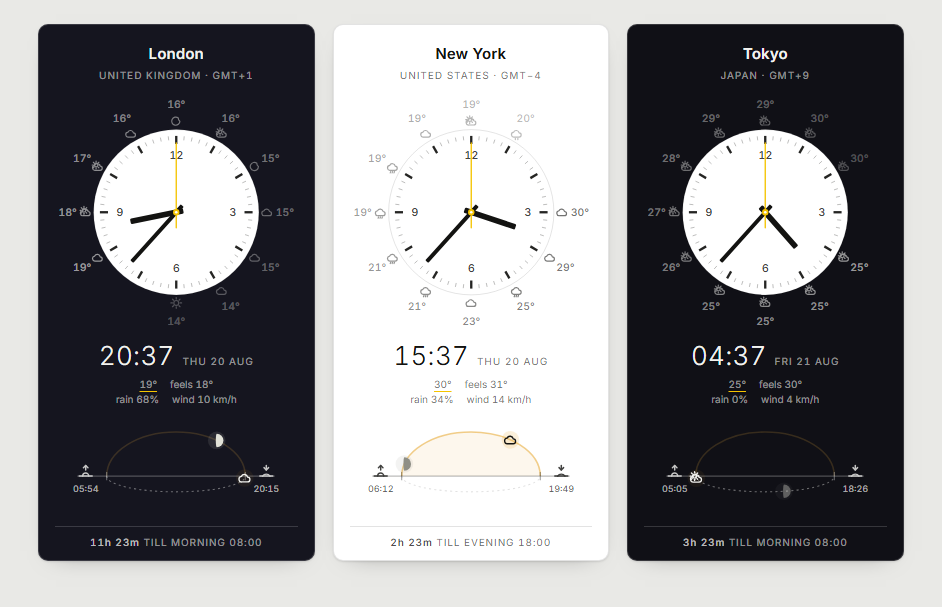

**Temperature** switches between `°C` and `°F`. Open-Meteo is asked for Celsius and
the conversion happens locally, so switching units costs no request and never
invalidates the cache.

**Dome**: icons along the sky dome for the hours remaining in the current span, now
until sunset by day, now until sunrise by night. Spaced by distance along the arc
rather than by clock hour, because `skyX` is a cosine that barely moves near sunrise
and sunset while the hours keep passing, so every-Nth-hour piles them into a heap at
the ends. The trade-off is that a span with little arc left shows fewer icons; late
afternoon might only fit two before sunset. They follow the sun's own direction of
travel, so at night, in the trough, they read right to left.

**Off**: no forecast, no requests, and the dial gets a slightly roomier viewBox.

Data comes from [Open-Meteo](https://open-meteo.com), which needs no API key and
allows browser requests. One call per city covers 72 hours; responses are cached in
`localStorage` for 30 minutes. If the request fails, the icons simply don't appear.

Every setting in the menu persists to `localStorage`.

## Deploying

The site is static files at the repository root, so there is nothing to build.
`wrangler.jsonc` declares an assets-only Cloudflare Worker with no script and no `main`
entry, and `.assetsignore` keeps the repo's own files (this README, `docs/`) out of
the deployed bundle. Keeping the config in the repo rather than only in the dashboard
means the deploy is reviewable and reproducible.

Nothing here needs server-side code today. If it ever does, an assets-only Worker
becomes a Worker with a handler by adding one file and a `main` entry, so there is no
migration to plan for. The candidates, in the order I would actually bother:

1. **Caching the forecast at the edge.** Each visitor's browser currently fetches
   about 1.6 KB per city straight from Open-Meteo, taking roughly 0.8 s. Caching per
   city for 30 minutes would let all visitors share one upstream fetch, which protects
   the free quota, speeds up first paint, and stops visitors' addresses reaching a
   third party.
2. **Dynamic social preview images**, rendering the actual dials for the cities in a
   shared link. The one item here that genuinely cannot be done in the browser.
3. **A plain-text endpoint**, so `curl timezones.cc/tokyo` answers from a terminal.

Worth noting what does *not* need code: defaulting the board to the visitor's own zone
(`Intl.DateTimeFormat().resolvedOptions().timeZone` gives it client-side), self-hosting
Inter (commit the woff2), and analytics.

## Sun and moon calculations

Sunrise and sunset are computed in-page from each city's latitude and longitude
using the standard NOAA sunrise equation, with the −0.833° altitude used for the
apparent solar disc. Spot-checked against published almanac times for London,
New York, Singapore and Sydney at both solstices, agreement within ~2 minutes.

Placing the two bodies on the dome takes more than a pair of times, since each has to
be somewhere at every moment, including under the horizon. So each gets a right
ascension, a declination and an hour angle, and `domeSpot` turns those into a position:
`|H| < W` is above the horizon and on the arc, the rest is the trough, where `W` is the
same half-day-length term the sunrise equation uses, which is why the arc's ends agree
with the printed sunrise and sunset. No scanning for moonrise, and nothing to special
case between day and night.

The series are the usual low-precision ones, good to about a minute of arc for the sun
and 0.3° for the moon, which at this size is a fraction of a pixel. Both depend only on
the instant, so they are evaluated once per frame and shared by every card; only the
hour angle is per city. The phase comes from the elongation between the two, so it is
consistent with where they are drawn: the new moon of 12 August 2026, the day of that
solar eclipse, computes as 0.0% lit at 17:46 UTC.

Polar day and polar night are handled: the labels become `midnight sun` / `polar night`
and a circumpolar body runs once round its half of the dome per day. Tromsø and
Longyearbyen are in the list, so that branch is reachable; try Longyearbyen in June or
December.

Adding a city means one row in the `CITY_DATA` table near the top of the script.
The last three fields are optional:

```js
["Name", "Country", "IANA/Zone", lat, lon, "extra search terms", "Region", "id-override"]
```

To check a batch of additions, loop `CITIES` in the console, calling
`Intl.DateTimeFormat` with each `tz` to confirm the runtime knows the zone, and
`sunFor` to confirm sunrise precedes sunset.
